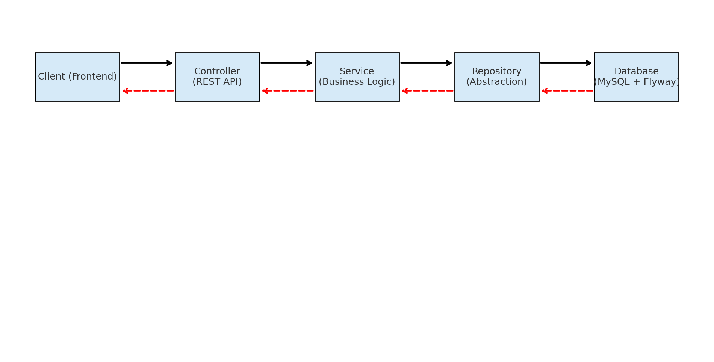

# ProductApp (Spring Boot Monolith Scaffold)

This is a **Spring Boot Modular Monolith scaffold** with a clean architecture structure using **Maven, MySQL, Flyway**,  and **Spring Security**.

---

[Onboarding](ONBOARDING.md) | [Future Expansion](FUTURE_EXPANSION.md)

---

## Foundation Features (Checklist with Explanations)

This scaffold includes all the essentials to build enterprise-grade applications:

### 1. **Entities**
- **What**: Java classes annotated with `@Entity` representing database tables.  
- **Use**: Encapsulate domain data and behavior (e.g., `Product`).  
- **Communicates with**: Repositories (for persistence).  
- **Why**: Ensures a clean mapping between the **domain model** and the database schema.  

---

### 2. **Repositories**
- **What**: Interfaces in the **domain layer** defining persistence contracts, with concrete implementations in **infrastructure layer** (Spring Data JPA).  
- **Use**: Encapsulate data access operations like `findById`, `save`, etc.  
- **Communicates with**: Entities (read/write) and Services (business logic layer).  
- **Why**: Provides abstraction → business logic doesn’t depend on DB implementation.  

---

### 3. **DTOs (Data Transfer Objects)**
- **What**: Simple POJOs used to transfer data across layers (e.g., `ProductRequest`, `ProductResponse`).  
- **Use**: Prevent exposing entities directly to the outside world.  
- **Communicates with**: Controllers (input/output) and Services (conversion).  
- **Why**: Improves **security, decoupling, and API stability**.  

---

### 4. **Services**
- **What**: Classes implementing business logic (e.g., `ProductService`).  
- **Use**: Orchestrate operations, enforce rules, interact with repositories.  
- **Communicates with**: Repositories (for data access) and Controllers (to serve data).  
- **Why**: Keeps business logic centralized and reusable.  

---

### 5. **Controllers**
- **What**: REST endpoints (`@RestController`) exposing APIs to frontend/clients.  
- **Use**: Map HTTP requests → service calls → return DTO responses.  
- **Communicates with**: Services (to get business results), DTOs (to expose data).  
- **Why**: Thin layer responsible only for **request/response handling**.  

---

### 6. **Global Exception Handler**
- **What**: `@ControllerAdvice` that handles exceptions centrally.  
- **Use**: Converts Java exceptions into clean JSON responses.  
- **Communicates with**: Controllers (catches their exceptions).  
- **Why**: Ensures **consistent error responses** and avoids code duplication.  

---

### 7. **Profiles (dev, staging, prod)**
- **What**: Environment-specific config files (`application-dev.yml`, `application-staging.yml`, `application-prod.yml`).  
- **Use**: Control DB connections, logging, and other settings per environment.  
- **Communicates with**: Spring Boot runtime.  
- **Why**: Clean separation → developers, QA, and production can run different configs.  

---

### 8. **Flyway**
- **What**: Database migration tool.  
- **Use**: Manage schema changes via versioned SQL scripts.  
- **Communicates with**: Database (applies migrations on startup).  
- **Why**: Ensures **schema consistency** across all environments.  

---

### 9. **Logging (SLF4J + Logback)**
- **What**: Logging framework with daily file rotation + console output.  
- **Use**: Log system events, errors, and audit trails.  
- **Communicates with**: All layers (service logs, exception logs).  
- **Why**: Crucial for debugging, monitoring, and production support.  

---

### 10. **API Documentation (Springdoc OpenAPI + Swagger UI)**
- **What**: Auto-generated API documentation.  
- **Use**: Provides interactive UI (`/swagger-ui.html`) and JSON spec (`/v3/api-docs`).  
- **Communicates with**: Controllers (reads their annotations).  
- **Why**: Makes APIs discoverable, testable, and self-documented.  

---

### 11. **Lombok**
- **What**: Library to reduce boilerplate (`@Getter`, `@Setter`, `@Builder`, etc.).  
- **Use**: Simplifies entities and DTOs by auto-generating getters, setters, etc.  
- **Communicates with**: Compile-time annotation processor.  
- **Why**: Keeps codebase **clean and concise** without redundant methods.

---

### 12. **Security (Spring Security + JWT)**
- **What**: Authentication/authorization for APIs using JWT (Bearer tokens).
- **Use**: Protect endpoints; allow public access only for auth and docs.
- **Communicates with**: Controllers (route protection), Filters (JWT parsing), UserDetailsService (user lookup).
- **Why**: Secure by default; works well for SPAs/mobile; stateless & scalable.

---

### 13. **Mapping (MapStruct)**
- **What**: Compile-time bean mapper (no reflection) for converting Entities ↔ DTOs.
- **Use**: Define a mapper interface; MapStruct generates the implementation.
- **Communicates with**: Controllers (DTOs) & Services/Repositories (entities).
- **Why**: Eliminates manual mapping code; safer & faster than reflection mappers.

---


## Profiles

- **Dev** → local development (debug logs, local MySQL)  
- **Staging** → QA/UAT pre-production environment  
- **Prod** → production system (secure configs via env vars)  

Activate a profile with:
```bash
mvn spring-boot:run -Dspring-boot.run.profiles=dev
```

---

## API Documentation

After starting the application, open `http://localhost:8080/swagger-ui.html` in your browser to view the interactive Swagger UI. The generated OpenAPI specification is available at `http://localhost:8080/v3/api-docs`.

---

## Example API Response

```json
{
  "status": "success",
  "data": {
    "id": "123e4567-e89b-12d3-a456-426614174000",
    "name": "Laptop",
    "price": 1200.00
  },
  "message": "Product created successfully",
  "timestamp": "2025-08-28T12:00:00Z"
}
```

---


---

## System Architecture

Clean Architecture layer interactions:


---


---

## API Call Flow (Sequence Diagram)

The lifecycle of a request in this system:




---

## Project Folder Structure

The scaffold project structure is organized as follows:


